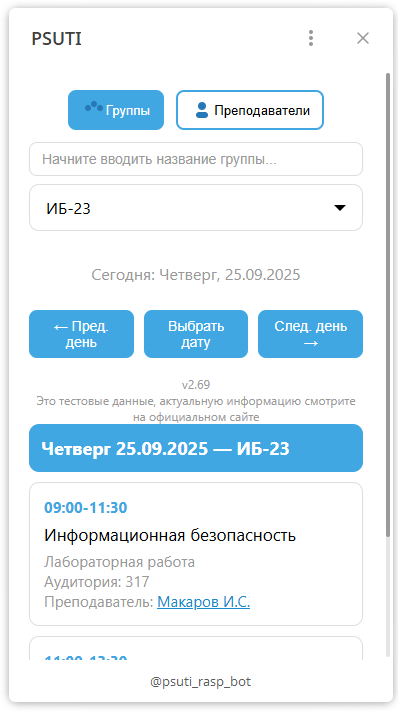
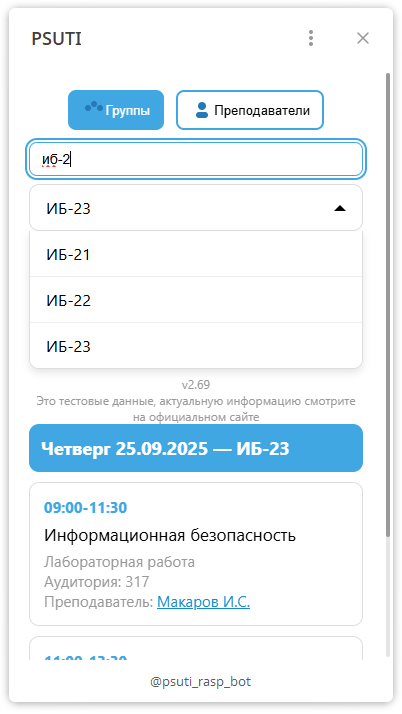
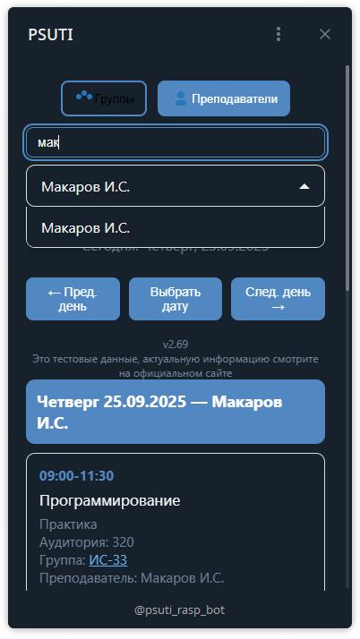
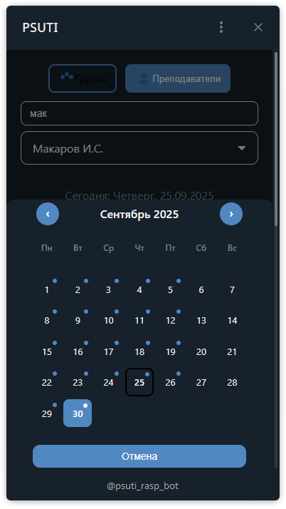

# Schedule Bot — мульти‑тенант платформа расписаний для университетов

<div align="center">








[](https://www.python.org/)
[](https://fastapi.tiangolo.com/)
[](https://redis.io/)
[](https://www.docker.com/)
[](./.gitlab-ci.yml)

</div>

Телеграм Mini App и API‑платформа, агрегирующая и публикующая расписания вузов под разными поддоменами. SEO‑страницы для шаринга, кэширование и лимиты, а также серверную генерацию PDF/изображений расписания.

— Решение ориентированное на масштабирование по вузам и пиковым нагрузкам.

## 🎯 Примеры работающих ботов

- 🤖 [@psuti_rasp_bot](https://t.me/psuti_rasp_bot?startapp=go) — Telegram бот с Mini App
- 🌐 Поддомен: `psuti.raspisanie.space`
- 📱 Полнофункциональное приложение для студентов и преподавателей

- 🤖 [@kspsuti_rasp_bot](https://t.me/kspsuti_rasp_bot?startapp=go) — Telegram бот с Mini App
- 🌐 Поддомен: `kspsuti.raspisanie.space`
- 📱 Полнофункциональное приложение для студентов и преподавателей

- 🤖 [@samgups_rasp_bot](https://t.me/samgups_rasp_bot?startapp=go) — Telegram бот с Mini App
- 🌐 Поддомен: `samgups.raspisanie.space`
- 📱 Полнофункциональное приложение для студентов и преподавателей

## Ключевые ценности
- **Единая платформа расписаний**: одно приложение — много вузов (multi‑tenant), изоляция данных по поддоменам.
- **Telegram Mini App + Web**: мгновенный доступ без установки приложений, глубокая интеграция с ботом.
- **Высокая производительность**: Redis‑кэш, rate limiting, оптимизированные запросы.
- **Масштабируемость**: white‑label для новых вузов, быстрый деплой под новый бренд/домен.

## 🏛️ Поддерживаемые вузы и поддомены

| ВУЗ | Поддомен | Статус | Бот |
|-----|----------|--------|-----|
| **ПГУТИ** | `psuti.raspisanie.space` | ✅ Активен | [@psuti_rasp_bot](https://t.me/psuti_rasp_bot) |
| **КСПСУТИ** | `kspsuti.raspisanie.space` | ✅ Активен | [@kspsuti_rasp_bot](https://t.me/kspsuti_rasp_bot) |
| **СамГУПС** | `samgups.raspisanie.space` | ✅ Активен | [@samgups_rasp_bot](https://t.me/samgups_rasp_bot) |
| **СГАУ** | `ssau.raspisanie.space` | 🚧 В разработке | @ssau_rasp_bot |
| **ССЭУ** | `sseu.raspisanie.space` | 🚧 В разработке | @sseu_rasp_bot |
| **СамГИК** | `samgik.raspisanie.space` | 🚧 В разработке | @samgik_rasp_bot |

## Основные возможности
- **Multi‑tenant архитектура**: автоматическое определение `tenant` по поддомену
- **Изоляция данных**: каждый вуз имеет отдельную базу данных и конфигурацию
- **Каталоги групп и преподавателей**, быстрый доступ к расписанию по дате.
- **Публичные SEO‑страницы**: индексируемые страницы для шаринга расписаний (группы/преподаватели), динамические `sitemap.xml` и `robots.txt`.
- **Кэширование в Redis**: горячие ответы для сегодня/завтра, TTL до 02:00 следующего дня, отдельные кэши по `tenant`.
- **Rate limiting**: ограничение для Telegram пользователей и веб‑публичных эндпоинтов.
- **Генерация PDF/изображений**: серверные PDF, пересылка в чаты через бота, отправка картинок.
- **Сохранение предпочтений пользователя**: последняя группа/преподаватель.
- **Готовность к продакшну**: Docker, docker‑compose, разделение сервисов, конфиги окружения.

## Технологический стек
- **Backend**: FastAPI, SQLAlchemy 2, Pydantic v2, SlowAPI (лимиты), Redis, ReportLab (PDF)
- **Telegram**: aiogram (multi‑bot per tenant), Telegram Mini App (WebApp)
- **Frontend**: статический `static/` (HTML/CSS/JS) для Web/Mini App
- **DB**: SQLite per tenant (простое масштабирование), Alembic/SQL миграции и вспомогательные скрипты
- **DevOps**: Docker, docker‑compose, GitLab CI/CD, Nginx/Passenger (варианты деплоя)

## 🏗️ Архитектура и маршрутизация поддоменов

### Схема маршрутизации
```
psuti.raspisanie.space    → PSUTI tenant (app/core/config.py)
ssau.raspisanie.space     → СГАУ tenant  
kspsuti.raspisanie.space  → КСПСУТИ tenant
sseu.raspisanie.space     → ССЭУ tenant
samgups.raspisanie.space  → СамГУПС tenant
samgik.raspisanie.space   → СамГИК tenant
```

### Техническая архитектура
```
client (Telegram Mini App / Web)
        ↓
Nginx/Reverse Proxy → FastAPI (app/main.py)
        ↓                   ↘  aiogram (multi‑bot per tenant)
   Redis (cache)           SQLite per tenant (data/tenants/*.db)
```
- **Multi‑tenant**: сопоставление поддомена → конфиг/БД в `app/core/config.py`, фабрики сессий в `app/core/database.py`.
- **Слои**:
  - `app/services` — бизнес‑логика расписаний
  - `app/schemas` — Pydantic‑схемы
  - `app/models` — ORM‑модели
  - `app/bot` — Telegram‑бот (команды, интеграция WebApp)
  - `static/` — фронтенд активы и SEO

## Структура репозитория (основное)
- `app/main.py` — API, middleware, кэш, лимиты, публичные страницы, webapp endpoints
- `app/core/config.py` — настройки, маппинг поддомена → tenant, токены ботов
- `app/core/database.py` — сессии/энджины per tenant, авто‑создание баз
- `app/services/schedule.py` — бизнес‑логика расписаний
- `app/bot/*` — Telegram‑бот и хэндлеры
- `static/*` — фронтенд, favicon, SEO, превью
- `docker-compose.yml`, `Dockerfile*` — контейнеризация

## Backend: API и безопасность
- **Публичные эндпоинты** (для SEO/веб):
  - `GET /public/groups/`, `GET /public/teachers/`
  - `GET /public/groups/{group_id}/schedule/{date}`
  - `GET /public/teachers/{teacher_name}/schedule/{date}`
  - `GET /share/page?mode=...` — SEO страница рендеринга расписания
  - `GET /sitemap.xml`, `GET /robots.txt`
- **Защищённые эндпоинты** (Mini App):
  - `GET /groups/`, `GET /teachers/`
  - `GET /groups/{group_id}/schedule/{date}`
  - `GET /teachers/{teacher_name}/schedule/{date}`
  - `POST /webapp/*` — взаимодействие Mini App ↔ бот
- **Авторизация**: верификация Telegram `initData` по HMAC (см. `check_telegram_init_data`). Публичный режим может быть включён через `ALLOW_PUBLIC`.
- **Безопасность**: CORS, TrustedHost, базовая санитизация входных данных, security headers (CSP для статики), rate limiting per user/IP.

## Telegram Bot и Mini App
- Мульти‑бот: отдельный токен на каждого `tenant`, автоматический polling, снятие webhook на старте.
- Команды: `/start` (кнопка открытия Mini App), `/groups`, `/schedule <group_id>`.
- WebApp: серверные эндпоинты `/webapp/*`, отправка PDF/картинок, ответы на `answer_web_app_query`.

## Данные и базы
- **Модель**: группы, дни, занятия, преподаватели, пользователи (сохранение выбора).
- **Изоляция**: одна SQLite база на `tenant` (`./data/tenants/<tenant>.db`).
- **Миграции/импорт**: готовые скрипты (`import_*.py`, `migrate_*.py`, Alembic/SQL).

## Быстрый старт (локально)
1) Установить зависимости
```bash
python -m venv .venv && .venv\Scripts\activate  # Windows PowerShell
pip install -r requirements.txt
```
2) Создать файл `.env` (пример):
```bash
# Основные настройки
DOMAIN=raspisanie.space
ALLOW_PUBLIC=true

# Токены Telegram ботов для каждого вуза
BOT_TOKEN_PSUTI=1234567890:AAAAAAAAAAAAAAAAAAAAAAAAAAAAAAAAAA
BOT_TOKEN_SSAU=1234567890:BBBBBBBBBBBBBBBBBBBBBBBBBBBBBBBBBB
BOT_TOKEN_KSPSUTI=1234567890:CCCCCCCCCCCCCCCCCCCCCCCCCCCCCCCCCC
BOT_TOKEN_SSEU=1234567890:DDDDDDDDDDDDDDDDDDDDDDDDDDDDDDDDDD
BOT_TOKEN_SAMGUPS=1234567890:EEEEEEEEEEEEEEEEEEEEEEEEEEEEEEEEEE
BOT_TOKEN_SAMGIK=1234567890:FFFFFFFFFFFFFFFFFFFFFFFFFFFFFFFF

# Настройки Redis
REDIS_HOST=localhost
REDIS_PORT=6379
REDIS_DB=0
REDIS_PASSWORD=
```
3) Запуск API
```bash
python run.py
```
API: `http://127.0.0.1:8000/`

## Запуск в Docker (с Redis)
```bash
docker compose up --build -d
```
- API: `http://localhost:8000/`
- Redis: `localhost:6379` (пароль задаётся через `REDIS_PASSWORD`)

## Переменные окружения (ключевые)
- `DOMAIN` — базовый домен (например, `raspisanie.space`)
- `ALLOW_PUBLIC` — разрешить публичный доступ (без Telegram initData)
- `TENANTS_DATA_PATH` — путь к БД арендаторов (по умолчанию `./data/tenants`)
- `BOT_TOKEN_*`, `BOT_USERNAME_*` — на каждый `tenant`
- `REDIS_*` — хост/порт/БД/пароль для кеша

## Производительность и наблюдаемость
- Redis‑кэш горячих ответов (сегрегация по tenant), TTL для сегодня/завтра.
- Статистика `GET /admin/stats`: количество запросов/ошибок, среднее время ответа, топ‑группы/преподаватели, состояние кеша.
- Лимиты на пользователя (Telegram) и IP (web public) через SlowAPI.

## Деплой (прод)
- Вариант: VPS + Docker + reverse proxy (Nginx/Caddy/Traefik) + SSL (Let's Encrypt).
- Маппинг поддоменов → сервис (один сервис, multi‑tenant). Секреты через `.env`.
- Горизонтальное масштабирование: вынесенный Redis для общего кеша, sticky‑sessions не требуются.

## 🎬 Демонстрация функциональности

### Активные боты (готовы к использованию)

**PSUTI**: [@psuti_rasp_bot](https://t.me/psuti_rasp_bot?startapp=go) | [psuti.raspisanie.space](https://psuti.raspisanie.space)

**КСПСУТИ**: [@kspsuti_rasp_bot](https://t.me/kspsuti_rasp_bot?startapp=go) | [kspsuti.raspisanie.space](https://kspsuti.raspisanie.space)

**СамГУПС**: [@samgups_rasp_bot](https://t.me/samgups_rasp_bot?startapp=go) | [samgups.raspisanie.space](https://samgups.raspisanie.space)

### Функциональность
1. **Telegram Mini App** — откройте любого бота и нажмите "Open App"
2. **Поиск групп/преподавателей** — быстрый поиск по названию
3. **Расписание на дату** — выбор любой даты в календаре
4. **Экспорт в PDF** — генерация и отправка расписания
5. **SEO страницы** — публичные страницы для шаринга

### Скриншоты функциональности
- `static/images/screenshots/1.png` — главная страница Mini App
- `static/images/screenshots/2.png` — поиск групп/преподавателей  
- `static/images/screenshots/3.png` — расписание на день
- `static/images/screenshots/4.png` — выбор даты
- `static/images/screenshots/5.png` — основная страница сайта PSUTI

## Тесты и качество
- Юнит‑тесты в `tests/`.
- GitLab CI/CD конфиг: `.gitlab-ci.yml` (линты/тесты/сборка образа — под проект).


